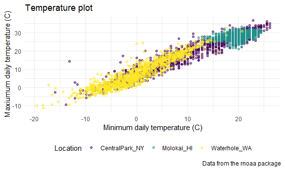
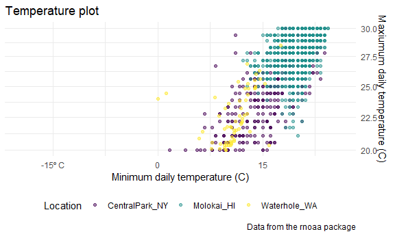
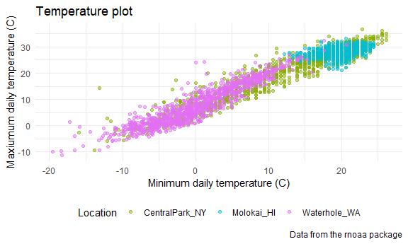
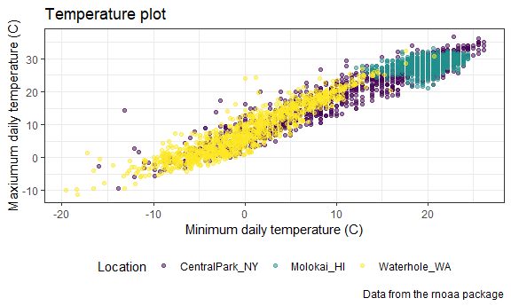
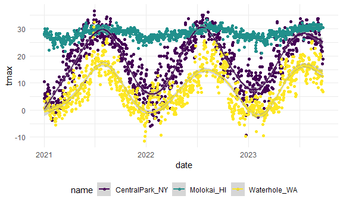
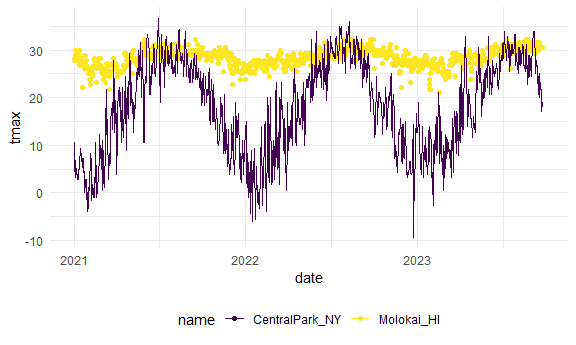
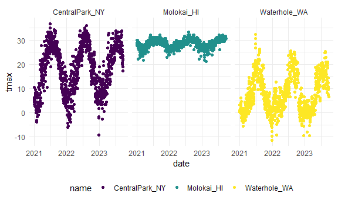
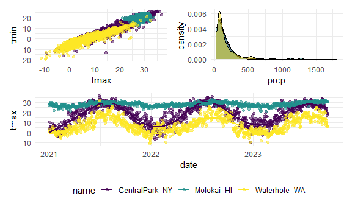
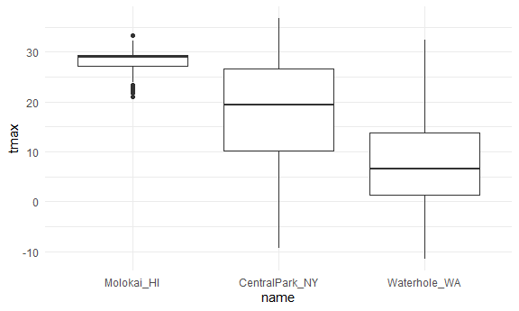
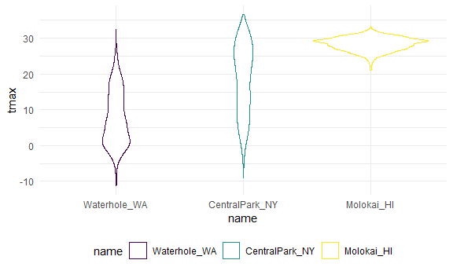

viz_part2
================
Ruoxi Li
2023-10-03

``` r
library(tidyverse)
```

    ## ── Attaching core tidyverse packages ──────────────────────── tidyverse 2.0.0 ──
    ## ✔ dplyr     1.1.3     ✔ readr     2.1.4
    ## ✔ forcats   1.0.0     ✔ stringr   1.5.0
    ## ✔ ggplot2   3.4.3     ✔ tibble    3.2.1
    ## ✔ lubridate 1.9.2     ✔ tidyr     1.3.0
    ## ✔ purrr     1.0.2     
    ## ── Conflicts ────────────────────────────────────────── tidyverse_conflicts() ──
    ## ✖ dplyr::filter() masks stats::filter()
    ## ✖ dplyr::lag()    masks stats::lag()
    ## ℹ Use the conflicted package (<http://conflicted.r-lib.org/>) to force all conflicts to become errors

``` r
library(ggplot2)
library(patchwork)
```

## setting options

``` r
library(tidyverse)

knitr::opts_chunk$set(
  fig.width = 6,
  fig.asp = .6,
  out.width = "90%"
)

theme_set(theme_minimal() + theme(legend.position = "bottom"))

options(
  ggplot2.continuous.colour = "viridis",
  ggplot2.continuous.fill = "viridis"
)

scale_colour_discrete = scale_colour_viridis_d
scale_fill_discrete = scale_fill_viridis_d
```

## data import

``` r
weather_df = 
  rnoaa::meteo_pull_monitors(
    c("USW00094728", "USW00022534", "USS0023B17S"),
    var = c("PRCP", "TMIN", "TMAX"), 
    date_min = "2021-01-01",
    date_max = "2023-12-31") |>
  mutate(
    name = recode(
      id, 
      USW00094728 = "CentralPark_NY", 
      USW00022534 = "Molokai_HI",
      USS0023B17S = "Waterhole_WA"),
    tmin = tmin / 10,
    tmax = tmax / 10) |>
  select(name, id, everything())
```

    ## using cached file: C:\Users\Lenovo\AppData\Local/R/cache/R/rnoaa/noaa_ghcnd/USW00094728.dly

    ## date created (size, mb): 2023-09-28 10:20:27.523071 (8.541)

    ## file min/max dates: 1869-01-01 / 2023-09-30

    ## using cached file: C:\Users\Lenovo\AppData\Local/R/cache/R/rnoaa/noaa_ghcnd/USW00022534.dly

    ## date created (size, mb): 2023-09-28 10:21:05.222055 (3.838)

    ## file min/max dates: 1949-10-01 / 2023-09-30

    ## using cached file: C:\Users\Lenovo\AppData\Local/R/cache/R/rnoaa/noaa_ghcnd/USS0023B17S.dly

    ## date created (size, mb): 2023-09-28 10:21:15.965282 (0.996)

    ## file min/max dates: 1999-09-01 / 2023-09-30

## labels

``` r
weather_df |> 
  ggplot(aes(x = tmin, y = tmax)) + 
  geom_point(aes(color = name), alpha = .5)+
  labs(
    title = "Temperature plot",
    x = "Minimum daily temperature (C)",
    y = "Maxiumum daily temperature (C)",
    color = "Location",
    caption = "Data from the rnoaa package"
  )
```

    ## Warning: Removed 33 rows containing missing values (`geom_point()`).



## scales

``` r
weather_df |> 
  ggplot(aes(x = tmin, y = tmax)) + 
  geom_point(aes(color = name), alpha = .5) + 
  labs(
    title = "Temperature plot",
    x = "Minimum daily temperature (C)",
    y = "Maxiumum daily temperature (C)",
    color = "Location",
    caption = "Data from the rnoaa package") + 
  scale_x_continuous(
    breaks = c(-15, 0, 15), 
    labels = c("-15º C", "0", "15"))+
 scale_y_continuous(
    limits = c(20,30),
     trans = "sqrt",
    position = "right")
```

    ## Warning in self$trans$transform(x): 产生了NaNs

    ## Warning: Transformation introduced infinite values in continuous y-axis

    ## Warning: Removed 1707 rows containing missing values (`geom_point()`).



## colors

``` r
weather_df |> 
  ggplot(aes(x = tmin, y = tmax)) + 
  geom_point(aes(color = name), alpha = .5) + 
  labs(
    title = "Temperature plot",
    x = "Minimum daily temperature (C)",
    y = "Maxiumum daily temperature (C)",
    color = "Location",
    caption = "Data from the rnoaa package") + 
  scale_color_hue(h = c(100,300))
```

    ## Warning: Removed 33 rows containing missing values (`geom_point()`).



0-360

``` r
ggp_temp_plot = 
  weather_df |> 
  ggplot(aes(x = tmin, y = tmax)) + 
  geom_point(aes(color = name), alpha = .5) + 
  labs(
    title = "Temperature plot",
    x = "Minimum daily temperature (C)",
    y = "Maxiumum daily temperature (C)",
    color = "Location",
    caption = "Data from the rnoaa package"
  ) + 
  viridis::scale_color_viridis(
    name = "Location", 
    discrete = TRUE
  )
ggp_temp_plot
```

    ## Warning: Removed 33 rows containing missing values (`geom_point()`).


lost a part

## themes

背景变成black、white,把颜色bar移到下面 theme_bw()需要在变换位置前面
theme_classic() theme_minimal()

``` r
ggp_temp_plot + 
   #theme_classic()+
   theme_bw()+
  theme(legend.position = "bottom")
```

    ## Warning: Removed 33 rows containing missing values (`geom_point()`).



## data argument

``` r
weather_df |>
  ggplot(aes(x = date, y =tmax,color=name))+
  geom_point()+
  geom_smooth()
```

    ## `geom_smooth()` using method = 'gam' and formula = 'y ~ s(x, bs = "cs")'

    ## Warning: Removed 33 rows containing non-finite values (`stat_smooth()`).

    ## Warning: Removed 33 rows containing missing values (`geom_point()`).



``` r
central_park_df = 
  weather_df |> 
  filter(name == "CentralPark_NY")

molokai_df = 
  weather_df |> 
  filter(name == "Molokai_HI")

ggplot(data = molokai_df, aes(x = date, y = tmax, color = name)) + 
  geom_point() + 
  geom_line(data = central_park_df) 
```

    ## Warning: Removed 6 rows containing missing values (`geom_point()`).

    ## Warning: Removed 5 rows containing missing values (`geom_line()`).



lost part:month scale

## ‘patchwork’

``` r
weather_df |>
  ggplot(aes(x = date, y =tmax,color=name))+
  geom_point()+
  facet_grid(.~name)
```

    ## Warning: Removed 33 rows containing missing values (`geom_point()`).



``` r
tmax_tmin_p = 
  weather_df |> 
  ggplot(aes(x = tmax, y = tmin, color = name)) + 
  geom_point(alpha = .5) +
  theme(legend.position = "none")

prcp_dens_p = 
  weather_df |> 
  filter(prcp > 25) |> 
  ggplot(aes(x = prcp, fill = name)) + 
  geom_density(alpha = .5) + 
  theme(legend.position = "none")

tmax_date_p = 
  weather_df |> 
  ggplot(aes(x = date, y = tmax, color = name)) + 
  geom_point(alpha = .5) +
  geom_smooth(se = FALSE) + 
  theme(legend.position = "bottom")

(tmax_tmin_p+prcp_dens_p)/tmax_date_p 
```

    ## Warning: Removed 33 rows containing missing values (`geom_point()`).

    ## `geom_smooth()` using method = 'gam' and formula = 'y ~ s(x, bs = "cs")'

    ## Warning: Removed 33 rows containing non-finite values (`stat_smooth()`).
    ## Removed 33 rows containing missing values (`geom_point()`).



## data manipulation

lost

``` r
weather_df|>
  mutate(
    name = fct_relevel(name, c("Molokai_HI","CentralPark_NY","Waterhole_WA"))
  ) |>
ggplot(aes(x = name, y = tmax))+
  geom_boxplot()
```

    ## Warning: Removed 33 rows containing non-finite values (`stat_boxplot()`).



``` r
weather_df|>
  mutate(
    name = fct_reorder(name,tmax)
  ) |>
  ggplot(aes(x = name, y = tmax,color=name))+
  geom_violin()
```

    ## Warning: There was 1 warning in `mutate()`.
    ## ℹ In argument: `name = fct_reorder(name, tmax)`.
    ## Caused by warning:
    ## ! `fct_reorder()` removing 33 missing values.
    ## ℹ Use `.na_rm = TRUE` to silence this message.
    ## ℹ Use `.na_rm = FALSE` to preserve NAs.

    ## Warning: Removed 33 rows containing non-finite values (`stat_ydensity()`).


